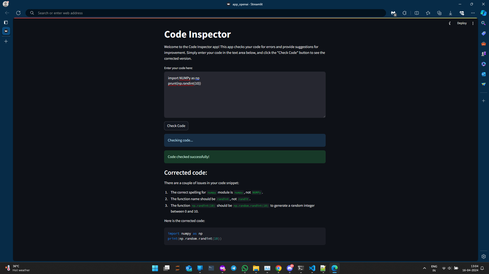

# GenAI Code Inspector

## Overview
GenAI Code Inspector is a Python application that utilizes the OpenAI API to provide code review functionality for any programming language. It allows users to submit code snippets for review and receive feedback on potential bugs, errors, and suggestions for improvement. The application is built using Streamlit for the user interface.

## Features
- Clean and intuitive user interface built with Streamlit.
- Automatic code review using the OpenAI API.
- Identification of potential bugs, errors, and areas of improvement for any programming language.
- Display of corrected code snippets.
- Display of bug reports.

## Usage
To use GenAI Code Inspector, follow these steps:
1. Clone the repository to your local machine.
2. Install the required dependencies. `pip install -r requirements.txt`
3. Obtain an API key from OpenAI and save it to a file named `openai_key.txt` in the project directory.
4. Run the Streamlit app.
5. Enter your code snippet in the text area, then click the "Check Code" button to see the corrected version and bug reports.
